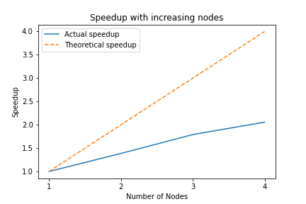
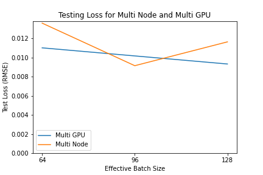
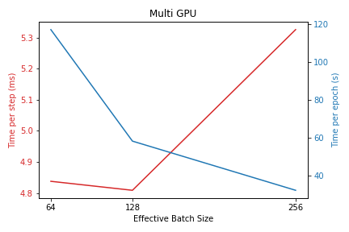
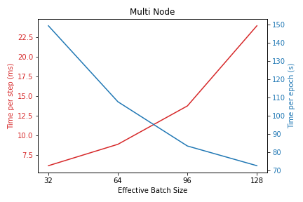

# Phase II: Model Training

### Background on LSTM Models

As discussed in the problem background, Long-Short-Term Memory models are a variant of recurrent neural networks (RNN). These style of networks take a univariate or multivariate sequence of data points, and pass each of these points through a series of "cells", which propagate information from the beginning of the sequence through to the end. Figure 1 below highlights a generalized recurrent neural network:

Source: [IBM, "What are Recurrent Neural Networks?"](https://www.ibm.com/cloud/learn/recurrent-neural-networks)

Unlike in a typical statistical model, where a vector of inputs at $x_t$ maps to a single or many outputs at one time, $y_t$, recurrent neural networks pass information in the form of hidden nodes (here denoted in green). While some recurrent networks are bidirectional (i.e. can effective pass information in both directions), our project restricts the environment such that an output at $y_t$ may depend only on previous points $x_t$, $x_{t-1}, \ldots$. Moreover, the architecture described is flexible, and can map a many inputs to either a single time output or multiple time steps.  As with the optimization of most deep learning methods, standard optimization of RNNs proceeds through the backpropagation algorithm, in particular an algorithm known as "Back Propagation Through Time", or BPTT as it is commonly known (Goodfellow et al., 2016). Tracing the computational graph specified above, this is done by first calculating the gradients with respect to the final time step, and then applying the chain rule moving to the beginning of the sequence. For multi-output RNNs, some of these gradients may be added in over time. For example, in the recurrent structure to the right above, the gradient of the loss associated with $Y_1$ would not need to be calculated with respect to the third input, $X_3$. More specifically, the hidden cells of RNNs, $h_t$, and outputs, $y_t$ are governed by the following equations, where $tanh$ is used as the standard hidden node activation function (Goodfellow et al., 2016):

$$ h_t = tanh(b_0 + Wh_{t-1} + Ux_t) $$

$$ \hat{y_t} = \sigma(b_1 + Vh_t)$$

where $\sigma(\cdot)$ is the logistic function and the gradients are propagated according to the Jacobians of these functions at each time step. While the image above is illustrative, it shows only a short time sequence. Many applications, including high-resolution time series forecasting, rely on longer sequences. In those cases, these models often suffer from a "vanishing gradient" problem. Because there are many nonlinear gradient calculations, it is likely that at least one will be near zero, effectively preventing the information carried in the gradient to move back earlier into the sequence (Bengio et al., 1994).

One popular solution to this challenge is to introduce a series of gates to each recurrent hidden cell. In particular, one popular variant of this architecture is known as a Long Short-Term Memory (LSTM) (Hochreiter and Schmidhuber, 1997). The equations, demonstrated below, seek to break memory blocking experienced in traditional RNNs:

$$i_t = \sigma(W_i X_t + U_i h_{t-1} + \beta_i)$$

$$f_t = \sigma(W_f X_t + U_f h_{t-1} + \beta_f)$$

$$c_t = f_t \odot c_{t-1} +  i_t \odot g(W_{gx} X_t + W_{gh}h_{t-1} + \beta_g)$$

$$o_t = \sigma(W_o X_t  + U_o c_t + \beta_o)$$

$$h_t = o_t \odot g(c_t)$$

where $\odot$ represents element-wise multiplication, and $g(\cdot)$ represents the $tanh$ function (Sainath and Li, 2016). Immediately, however, it is clear that these models will have significantly more parameters to estimate, as well as calculations at each time step which must be propagated.

Originally popularized for language modeling, LSTMs have been applied -- and achieved success -- in many time-dependent domains. For example, Fischer and Krauss (2017) apply LSTMs to daily financial time series of the entire S&P500, showing performance gains over other machine learning techniques such as random forests and logistic classifiers. In more recent years, LSTMs have gained additional popularity for time series domains, in concert with other deep learning techniques (see e.g. Bao et al., 2017, Ghosh et al., 2020). More directly related to our problem, Lanbouri and Achchab (2020) study the applicability of LSTMs to high-frequency financial time series, considering minute-by-minute predictions for the S&P500.

In this project, we advance this methodology by extending the network size described in Lanbouri and Achchab (2020), adding data for all 500 stocks of the S&P500. Our parallelization strategy, described below, allows for this significantly higher volume of training data to be fed into the model efficiently. Moreover, we demonstrate that by parallelizing each epoch of training data, we maintain accuracy while seeing substantial speedup.

### Parallelization Challenges & Opportunities

*Challenges*

- Due to the sequential calculations described above, there are limits to the extent of parallelization possible.

*Opportunities*

- The calculations within each LSTM unit are fundamentally matrix and element-wise multiplication. These calculations are well-suited for GPU accelerated computing designed for these types of calculation.
- Gradient descent is an iterative algorithm, relying on gradient updates for many training examples. Given the large nature of our data, we can parallelize the extent that each batch of training samples are passed to the model.

### Formal Description & Solution

While some authors seek to develop novel CUDA routines (see e.g. Martin and Cundy, 2018) or develop novel architectures to exploit parallelism (e.g. Bouaziz et al. 2016), we take an alternate approach. Given our large training sample size of roughly 1 million samples, we seek to parallelize training, distributing parts of each epoch to separate worker nodes. First, we use GPU computation to speed up matrix multiplication. Because TensorFlow (our framework) implements this under the hood, and it is nearly ubiquitous in deep learning model training, we have not formally calculated the relevant speedup, instead focusing on parallelization of the training process between GPUs in a single node and across nodes.

One of the most evident examples of the potential for this speedup is ImageNet, a Deep Convolutional Neural Network. Trained on millions of images, the original model required 29 hours to train on an 8 GPU node. However, utilizing a multi-node approach, Goyal et al. (2018) were able to achieve comparable accuracy to the original training by dividing the work amongst 32 nodes, each with 8 GPUs for a total of 256 worker nodes. This 29x speedup without a loss of accuracy demonstrates the promise of a multi-node approach and its scalability. We employ similar, albeit significantly smaller scale, testing of our models performance across multiple nodes. We would like to highlight, however, that our method is scalable and with sufficient financial resources and hardware tuning, could be scaled to 256 GPU nodes. Aside from the relevant financial constraints (our estimates suggest that 256 GPUs is roughly $1000 per hour on AWS), scaling performance may be next limited by developer overhead of orchestrating and tuning the MPI nodes!

This is orchestrated through the [Horovod platform](https://horovod.readthedocs.io/en/stable/summary_include.html). This platform, produced by Uber, provides wrapper functionality to parallelize the training of deep learning models, running in a scalable fashion on many GPUs and multiple nodes using [NCCL](https://developer.nvidia.com/nccl) to communicate between Nvidia GPUs and [OpenMPI](https://www.open-mpi.org/) to communicate between nodes. Generally, Horovod works by dividing the training data in each training epoch amongst the worker nodes. On each GPU worker node, the gradient updates proceed according to the batch size specification. However, after each batch, the GPU communicates this information to some other other nodes, using the Ring-AllReduce algorithm.

The Ring-AllReduce algorithm coordinates the updating of weights across the copies of the model in different nodes while also making most efficient use of available bandwidth.  This algorithm is implemented in two steps: The share-reduce phase, and the share phase.

Image source: [Uber, "Meet Horovod: Uber’s Open Source Distributed Deep Learning Framework for TensorFlow"](https://eng.uber.com/horovod/)

The share-reduce phase begins after each worker has calculated their respective gradients. The gradients (of size N) are then split up into chunks corresponding to the number of worker nodes (denoted by P). Thus each chunk has size (N/P). Each worker then passes one chunk of data to the next worker in a ring formation. The receiving worker then begins performing the reduction operation (by summing the weights). This occurs p-1 times, until all the chunks have been fully reduced and each worker holds a single fully reduced chunk.

The share phase then begins, where each worker passes their fully reduced chunk around the ring. The receiving workers update their own weights with the fully reduced weights and then passes it on to the next worker. This too occurs p-1 times such that each fully reduced chunk makes its way around the ring. At the end of the share phase, each worker has fully updated their weights and the next batch of data is ready to be passed through the network.

Compared to the parameter server model which sends 2N(P-1) amount of data through the network for each gradient update, the Ring-AllReduce algorithm only sends 2(N/P)(P-1) amount of data. This means that the Ring-AllReduce algorithm scales much better with increasing number of worker nodes (P).

Source: [Garcia, "Visual Intuition on Ring-AllReduce for Distributed Deep Learning"](https://towardsdatascience.com/visual-intuition-on-ring-allreduce-for-distributed-deep-learning-d1f34b4911da)

#### Model Details

- Layers:
  - LSTM  with 50 hidden nodes
  - Dropout with 0.3 of nodes dropped in each training pass
  - FFNN with 32 hidden nodes, activated by ReLU
  - Output, activated by ReLU to ensure positive price calculation
- Data Processing:
  - Inputs (sampled every minute):
    - Close Price
    - Trading Volume
  - Outputs:
    - Close Price, five minutes after the end of the sequence
  - Min-Max Normalization
  - Sequence Length: 60 (representing 60 minutes)
  - Data size:
    - Training: 775,248 sequences
    - Validation: 215,346 sequences
    - Test: 107,673 sequences
  - All sequences with missing price or volume information are dropped for the purposes of our experiments and prediction. While imputation could be a fruitful future direction, it is beyond the scope of this project.
- Optimizer: Adam, base learning rate equal to $0.0001$. As described above, this is linearly scaled in the number of workers (i.e GPUs) used.
- Batch Size: Baseline size of 32, though scaled in the experiments described below.

### Performance Evaluation

To evaluate the performance of the Ring-AllReduce algorithm, we test model training under two scenarios. First, on a single node with two GPUs. One of the biggest strengths of Horovod is its flexibility, as the API follows similarly along with OpenMPI. Thus, our second set of tests show the scalability of this approach across one to four nodes, each with a single GPU.

Two important logistical note regarding the below performance evaluations: First, due to cloud-provider constraints on total vCPUs, we were unable to test on multiple, multi-node GPUs at this time, though as our instructions indicate, scaling from one GPU on each of two nodes to two GPUs on each of two nodes is simply a change of three integers in a single command line execution. Second, because of these constraints, the the exact hardware varies slightly between scenario. We primarily focus on speedup results as we have benchmarked the single-GPU time for each machine as the baseline, but this limits the direct quantitative comparison of communication overheads.

In both cases, we run two tests. The first shows the strong scaling of each approach and compares this to the theoretical performance. Next, we show the the time-per epoch and time-per-step by effective batch size. This is more of a weak scaling approach. By keeping the per-node batch size equal, we roughly fix the work done by node and can tackle more training because of this.

#### Single Node, Multiple GPU per Node

*Figure 3: Accuracy Results*

| GPUs | Batch Size per GPU | Effective Batch Size | Test MSE |
| ---- | ------------------ | -------------------- | -------- |
| 1    | 32                 | 32                   | 0.000122 |
| 2    | 32                 | 64                   | 8.23E-05 |
| 1    | 64                 | 64                   | 8.71E-05 |
| 2    | 64                 | 128                  | 1.61E-04 |
| 1    | 128                | 128                  | 1.83E-04 |
| 2    | 128                | 256                  | 1.26E-04 |
| 1    | 256                | 256                  | 6.14E-05 |
| 2    | 256                | 512                  | 9.06E-05 |

From the above, we note that even when scaling the batch size substantially, the accuracy remains quite high. These results are in line with Lanbouri and Achchab (2020). While none of our specifications achieve quite as accurate results, our model is trained on a stock-by-stock basis, and is thus in-sample for any individual stock, potentially more important than a market aggregate. From a scientific perspective, this validates the approach of utilizing multiple GPUs, which can substantially accelerate training.

#### Multiple Nodes, Single GPU per Node

We get modest speedup from increasing the number of nodes in the cluster. At 4 nodes, the speedup achieved is 2.05.

#### Changing Effective Batch Sizes

Since each GPU/node runs its forward pass and calculates the gradients before averaging across batches, the effective batch size is the number of GPUs/nodes multiplied by the batch size for each GPU/node.

We note that changing the effective batch sizes does not change the test loss for a given number of training epochs. As such we experimented with different batch sizes to minimize time spent in training.

In the Multi GPU configuration, we trained the algorithm on 1 instance with 2 GPUs. Here we increased the effective batch size by increasing the batch size for each GPU. We see that the training time for each step increases marginally, while the training time per epoch decreases substantially as there is less communication overheads involved.

In the Multi Node configuration, we trained the algorithm on instances with 1 GPU, and increased the number of instances while keeping the batch size for each instance constant at 32. Here the effect of increasing the effective batch size (by increasing the number of nodes) is diminished, probably because of the additional communication complexity when adding each additional node.

#### Comparison & Analysis

Our key findings are that scaling efficiency diminishes fairly quickly for a relatively small LSTM model and amount of data. We also find that using larger batch sizes increases speedup without loss of accuracy for a fixed number of epochs. We think that we can take advantage of accelerated computing more by increasing the feature vectors and size of the hidden units in the LSTM. This will better take advantage of the matrix multiplication capabilities of the GPU and not increase communication overheads. To compensate for the increased processing time, we could decrease sequence length of the data while maintaining test accuracy.

### Reproducibility Instructions

To reproduce our results, follow the instructions in the [models directory](https://github.com/vrsivananda/CS205_FinalProject/tree/sr_models/stock_predict/models).

Replicabiity information about the instances are at the end of this README file.

### Sources

- Bao, Wei, Jun Yue, and Yulei Rao. 2017. "A deep learning framework for financial time series using stacked autoencoders and long-short term memory." *PLoS ONE* 12(7): July 2017
- Bengio, Yoshua, Patrice Simard, and Paolo Frasconi. 1994. "Learning long-term dependencies with gradient descent is difficult." *IEEE Transactions on Neural Networks* 5(2), March 1994.
- Bouaziz, Mohamed, Mohamed Morchid, Richard Dufour, Georges Linarès, and Renato De Mori. 2016. "Parallel Long Short-Term Memory for multi-stream classification." *2016 IEEE Spoken Language Technology Workshop (SLT)*, San Diego, CA, December 2016.
- Fischer, Thomas and Christopher Krauss. 2017. "Deep learning with long short-term memory networks for financial market predictions." *FAU Discussion Papers in Economics No. 11/2017*, Friedrich-Alexander-Universität Erlangen-Nürnberg, Institute for Economics, Nürnberg, May 2017.
- Ghosh, Pushpendu, Ariel Neufeld, and Jajati Keshari Sahoo. 2020. "Forecasting directional movements of stock prices for intraday trading using LSTM and random forests." Working paper, 2004.10178, *arXiv*. Available athttps://arxiv.org/abs/2004.10178.
- Goodfellow, Ian, Yoshua Bengio, and Aaron Courville. 2016. *Deep Learning*. Cambridge, MA: MIT Press, 2016.
- Goyal, Priya, Piotr Dollar, Ross Girshick, Pieter Noordhuis, Lukasz Wesolowski, Aapo Kyrola, Andrew Tulloch, Yangqing Jia, Kaiming He. 2018. "Accurate, Large Minibatch SGD: Training ImageNet in 1 Hour." *arXiv*. Available at, https://arxiv.org/abs/1706.02677.
- Hochreiter, Sepp and Jurgen Schmidhuber. 1997. "Long Short-Term Memory." *Neural Computation* 9(8): 1735-1780. 1997.
- Lanbouri, Zineb and Said Achchab. 2020. "Stock Market prediction on High frequency data using Long-Short
  Term Memory." *International Workshop on Artificial Intelligence & Internet of Things (A2IoT)*, Leuven, Belgium. August 2020.
- Martin, Eric and Chris Cundy. 2017. "Parallelizing Linear Recurrent Neural Nets Over Sequence Length." *ICLR*, Vancouver, BC, April 2018.
- Sainath, Tara and Bo Li. 2016. "Modeling Time-Frequency Patterns with LSTM vs. Convolutional Architectures for LVCSR Tasks." *Interspeech 2016*, 813-817.

## Replicability Information

All testing was conducted on AWS. Specification details are below:

### 2 - GPU Instance

- Instance: `g3.8xlarge`

| Hardware Spec.       | Details                                   |
| -------------------- | ----------------------------------------- |
| Model                | Intel(R) Xeon(R) CPU E5-2686 v4 @ 2.30GHz |
| # of vCPU            | 32                                        |
| Cores per CPU        | 16                                        |
| L1 Cache             | 64KB                                      |
| L2 Cache             | 256KB                                     |
| L3 Cache             | 30MB                                      |
| Main Memory          | 46GB                                      |
| \# of GPU            | 2                                         |
| GPU Type             | Nvidia Tesla M60                          |
| GPU Mem. (Per Unit)  | 8GB                                       |
| GPU Cores (Per Unit) | 2048                                      |
| GPU Peak performance | 150GFLOPs (64 bit); 4.825TFLOPs (32 bit)  |

| Software Spec.   | Details      |
| ---------------- | ------------ |
| Operating System | Ubuntu 18.04 |
| Compiler         | GCC 7.5.0    |
| Python           | 3.8.10       |
| CUDA             | 11.0.228     |
| CuDNN            | 8            |

| Python Package                                  | Version |
| ----------------------------------------------- | ------- |
| `NumPy`                                         | 1.19.5  |
| `tensorflow`                                    | 2.4.1   |
| `keras`                                         | 2.4.3   |
| `horovod`                                       | 0.21.3  |
| Other libraries part of Python Standard Library | 3.8.10  |

### Multi Node Instances

- Instance: `g3s.xlarge`

| Hardware Spec.       | Details                                   |
| -------------------- | ----------------------------------------- |
| Model                | Intel(R) Xeon(R) CPU E5-2686 v4 @ 2.30GHz |
| # of vCPU            | 4                                         |
| Cores per CPU        | 2                                         |
| L1 Cache             | 64KB                                      |
| L2 Cache             | 256KB                                     |
| L3 Cache             | 46MB                                      |
| Main Memory          | 30.5GB                                    |
| \# of GPU            | 1                                         |
| GPU Type             | Nvidia Tesla M60                          |
| GPU Mem. (Per Unit)  | 8GB                                       |
| GPU Cores (Per Unit) | 2048                                      |
| GPU Peak performance | 150GFLOPs (64 bit); 4.825TFLOPs (32 bit)  |

| Software Spec.   | Details      |
| ---------------- | ------------ |
| Operating System | Ubuntu 18.04 |
| Compiler         | GCC 7.5.0    |
| Python           | 3.8.10       |
| CUDA             | 11.0.228     |
| CuDNN            | 8            |

| Python Package                                  | Version |
| ----------------------------------------------- | ------- |
| `NumPy`                                         | 1.19.5  |
| `tensorflow`                                    | 2.4.1   |
| `keras`                                         | 2.4.3   |
| `horovod`                                       | 0.21.3  |
| Other libraries part of Python Standard Library | 3.8.10  |
