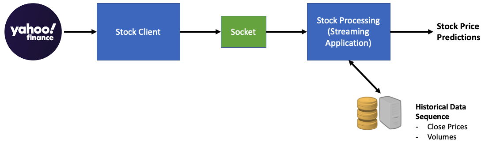
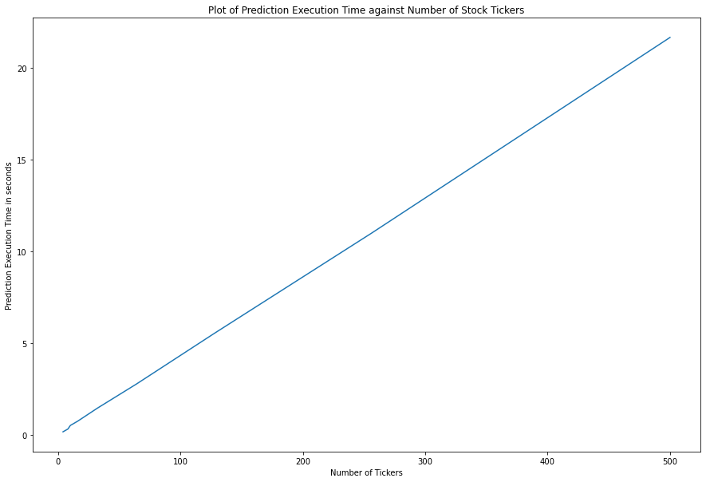
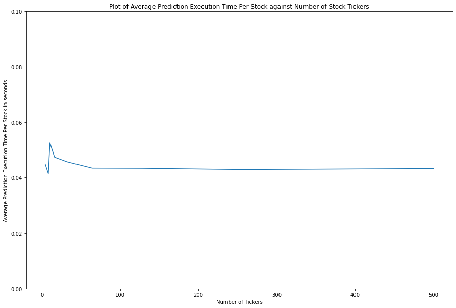

# Phase III: Prediction

#### Overview

The prediction phase is an important part of the project, as it represented the final output of our system in predicting the stock prices real time. 

The key challenge of this phase is to process the real-time streamed data quickly through Spark, and then predicting the price through our trained model. This is a problem of real-time stream data processing. Essentially, we would need to compute the prediction of one data element in an update window of the most recent data received. This computation of the prediction needs to be done in near real-time (low latency). The computations are generally independent between stocks and between time windows.

#### Programming Model

The stream dataset is constructed using the data from the `yfinance` API (see [here](https://pypi.org/project/yfinance/)). This is an API written in Python to access stock price and volume information down to the minute level. Because this application is written in Python, the scraper to communicate with the API must be in Python (or through Python bindings in another language). From there, the data are effectively split into stock-day components, and sequences are generated and concatenated together to form the training dataset. This data set is unbounded, and is only defined as the amount of ata that has entered the system so far. The processing is event-based and will not end until it is explicitly stopped. The prediction results are however available immediately and will be continuously updated as the new data arrives.

The stream processing is done such that the prediction results are computed based on the current updated stock data. We performed a prediction computation based on the trained model, with the data sequence (for LSTM) incorporating the latest data update. This processing is done in near real-time, so as to enable traders to respond to market changes quickly. 

The stream processing is done with the Spark programming model. In here, the data structure we are using is the Resilient Distributed Dataset (RDD). It works by splitting the data streams into batches within a time window, where Spark treats each batch of data (stock data from Yahoo Finance) as RDDs and processes them with RDD operations. The processed prediction results are then pushed out in batches.

##### Application Architecture

The prediction application architecture comprises of two key components, namely the "Stock Client" and the "Stock Processing Streaming Application".

The Stock Client essentially collects the latest stock data from Yahoo Finance, and cleans the data (removing NaN values), before passing the latest stock data through the socket to the Stock Processing Streaming Application.

The Stock Processing Streaming Application performs real-time processing of the incoming stock data, and computes the price prediction of each stock of interest within the time interval. More specifically, it splits the datastreams into individual stocks, before extracting the data features of interest (Close Price, Volume), accumulate the latest stock data in the historical data sequence, before predicting the stock price using the data sequence of the stock.

All testing and processing was implemented on an AWS `t2.2xlarge` instance, with 8 vCPU and 32 GB of memory. Please see the end of this discussion for extended replicability details.

#### Performance evaluation

To evaluate the performance of the prediction speed, we conducted the following tests and analysis. 

We varied the number of stocks to predict on a single AWS instance, and recorded the total time it took to predict the stock prices at each update event. The results are seen in the table and the plot below. 

As seen in the results, the average time taken to predict the price of each stock was about 0.045s. Hence, if we were to consider the time budget needed to receive the updated prediction price, we can vary the number of stocks to predict on an AWS instance to meet the required time budget.

| Number of Stocks | Time to Predict (s) | Average Prediction Time per Stock (s) |
| ---------------- | ------------------- | ------------------------------------- |
| 4                | 0.1795              | 0.0449                                |
| 8                | 0.3313              | 0.0414                                |
| 10               | 0.5257              | 0.0526                                |
| 16               | 0.7582              | 0.0474                                |
| 32               | 1.4627              | 0.0457                                |
| 64               | 2.7797              | 0.0434                                |
| 128              | 5.5524              | 0.0434                                |
| 256              | 10.9870             | 0.0429                                |
| 500              | 21.6437             | 0.0433                                |

#### Lessons & Future Direction

1. With a fully trained model, we were able to perform predictions real-time at approximately 0.045s/stock or 22 stocks/s on a relatively light-weight hardware. 
   1. This means that we would be able to bring real-time stock prediction close to the end-user with COTS machines to increase the access to our system.
   2. Depending on the time-budget requirement of the end-user, we can scale the problem size (number of stocks to predict) to meet the time budget requirement.
2. The latest data pulled from `yfinance` may contain NaN values, and would require additional processing to handle these NaN values, which would otherwise cause problem to the prediction using the LSTM model. 
3. Hence, some potential future research could include the exploration in increasing the resolution of prediction from 5 minutes ahead to 2 minutes ahead, since the time taken to predict the full set of S&P500 companies was about 20s. We can also explore the use of smaller machines for prediction, as this can help increase the access of our application to a larger number of end users, while reducing the overall operating cost. We also see a great potential in the use of Elephas for the prediction phase, as it may allow us to perform model predictions more efficiently.

#### Technical details

##### Replication

All testing was conducted on AWS. Specification details are below:

- Instance: `t2.2xlarge`

| Hardware Spec. | Details                                   |
| -------------- | ----------------------------------------- |
| Model          | Intel(R) Xeon(R) CPU E5-2676 v3 @ 2.40GHz |
| # of vCPU      | 8                                         |
| Cores per CPU  | 8                                         |
| L1 Cache       | 256KB                                     |
| L2 Cache       | 2MB                                       |
| L3 Cache       | 30MB                                      |
| Main Memory    | 32GB                                      |

| Software Spec.   | Details      |
| ---------------- | ------------ |
| Operating System | Ubuntu 20.04 |
| Compiler         | GCC 9.3.0    |
| Python           | 3.8.5        |
| Spark            | 3.1.1        |

| Python Package                                  | Version |
| ----------------------------------------------- | ------- |
| `NumPy`                                         | 1.19.2  |
| `yfinance`                                      | 0.1.59  |
| `pandas`                                        | 1.2.4   |
| `re`                                            | 2.2.1   |
| Other libraries part of Python Standard Library | 3.8.5   |

- Code profiler: cProfile, tables created via cProfile & `grep`

##### Sources

- https://harvard-iacs.github.io/2021-CS205/lectures/C3/
